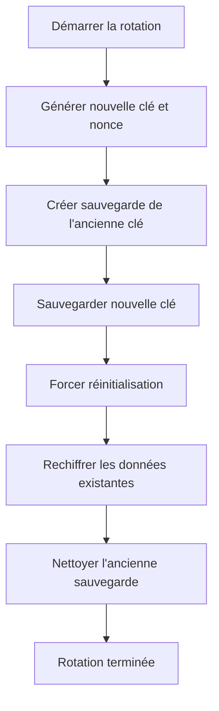
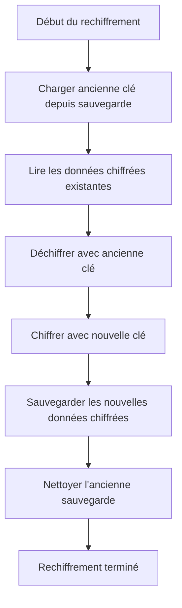

# Rotation des Clés de Chiffrement - Documentation

## Table des Matières

1. [Aperçu](#aperçu)
2. [Pourquoi la Rotation des Clés est Importante](#pourquoi-la-rotation-des-clés-est-importante)
3. [Implémentation](#implémentation)
4. [Cycle de Rotation](#cycle-de-rotation)
5. [Utilisation](#utilisation)
6. [Rechiffrement des Données](#rechiffrement-des-données)
7. [Bonnes Pratiques](#bonnes-pratiques)
8. [Sécurité Avancée](#sécurité-avancée)
9. [Dépannage](#dépannage)

## Aperçu

La rotation des clés est un processus de sécurité essentiel qui consiste à remplacer périodiquement les clés cryptographiques par de nouvelles. Cela limite l'impact potentiel d'une clé compromise et améliore la sécurité globale du système.

## Pourquoi la Rotation des Clés est Importante

### 1. Limitation de l'Exposition

- **Réduction de la fenêtre d'attaque** : Même si une clé est compromise, elle n'est utile que pour une période limitée
- **Conformité** : De nombreuses normes de sécurité (PCI DSS, HIPAA, GDPR) exigent une rotation régulière des clés
- **Meilleures pratiques** : Recommandé par NIST, ISO 27001 et autres cadres de sécurité

### 2. Atténuation des Risques

- **Protection contre les fuites** : Limite les dommages en cas de fuite de clé
- **Séparation des responsabilités** : Différentes clés pour différentes périodes
- **Audit et traçabilité** : Permet de suivre l'utilisation des clés dans le temps

### 3. Gestion du Cycle de Vie

- **Renouvellement automatique** : Processus systématique plutôt que réactif
- **Mise à jour des algorithmes** : Permet de migrer vers des algorithmes plus forts
- **Gestion des accès** : Révoquer l'accès en faisant tourner les clés

## Implémentation

### Fonctions Principales

```rust
/// Rotate the encryption key
pub fn rotate_encryption_key() -> Result<(), String>

/// Get key rotation status and information
pub fn get_key_rotation_info() -> Result<KeyRotationInfo, String>

/// Re-encrypt existing data with new key
pub fn reencrypt_data(&self, old_key: &secretbox::Key, old_nonce: &secretbox::Nonce, 
                     encrypted_data: &str) -> Result<String, String>
```

### Processus de Rotation



### Structure des Fichiers

```
~/.local/share/janus-monitor/security/
├── logging_key.bin          # Clé actuelle (permissions 0o600)
└── logging_key.bin.bak      # Sauvegarde de l'ancienne clé (permissions 0o600)
```

## Cycle de Rotation

### Stratégies de Rotation

#### 1. Rotation Basée sur le Temps

- **Périodique** : Toutes les 30, 60 ou 90 jours
- **Automatique** : Planifiée via un système de tâches cron ou systemd
- **Manuelle** : Initiée par un administrateur

#### 2. Rotation Basée sur l'Utilisation

- **Nombre de logs** : Après un certain nombre de logs chiffrés
- **Taille des données** : Après un certain volume de données chiffrées
- **Événements** : Après des événements de sécurité spécifiques

#### 3. Rotation Hybride

Combinaison des approches basées sur le temps et l'utilisation.

### Exemple de Politique de Rotation

```toml
# Politique de rotation recommandée
[key_rotation]
time_based = "30 days"      # Rotation toutes les 30 jours
usage_based = "10000 logs" # Ou après 10 000 logs
max_age = "90 days"        # Âge maximum d'une clé
backup_retention = "7 days" # Conservation des sauvegardes pendant 7 jours
```

## Utilisation

### Rotation Manuelle

```rust
use secure_key_storage;

fn main() -> Result<(), String> {
    // Vérifier l'état actuel
    let info = secure_key_storage::get_key_rotation_info()?;
    println!("Current key info: {:?}", info);
    
    // Effectuer la rotation
    secure_key_storage::rotate_encryption_key()?;
    println!("Key rotation completed successfully");
    
    // Vérifier le nouvel état
    let new_info = secure_key_storage::get_key_rotation_info()?;
    println!("New key info: {:?}", new_info);
    
    Ok(())
}
```

### Rotation Automatique

```rust
// Exemple d'intégration avec Tauri pour une rotation automatique

#[tauri::command]
async fn check_and_rotate_key_if_needed() -> Result<bool, String> {
    let info = secure_key_storage::get_key_rotation_info()?;
    
    // Vérifier si la rotation est nécessaire (par exemple, clé âgée de plus de 30 jours)
    let now = std::time::SystemTime::now();
    let key_age = now.duration_since(info.key_file_modified)
        .map_err(|e| e.to_string())?;
    
    if key_age.as_secs() > 30 * 24 * 60 * 60 { // 30 jours
        secure_key_storage::rotate_encryption_key()?;
        return Ok(true);
    }
    
    Ok(false)
}

#[tauri::command]
async fn get_key_rotation_status() -> Result<KeyRotationInfo, String> {
    secure_key_storage::get_key_rotation_info()
}
```

### Intégration avec l'Interface Utilisateur

```javascript
// Exemple d'interface utilisateur pour la rotation des clés
import { invoke } from '@tauri-apps/api/tauri';

async function checkKeyRotation() {
  try {
    const status = await invoke('get_key_rotation_status');
    console.log('Key rotation status:', status);
    
    if (status.key_file_exists && !status.backup_exists) {
      document.getElementById('rotation-status').textContent = 
        `Key last rotated: ${new Date(status.key_file_modified * 1000).toLocaleString()}`;
    }
  } catch (error) {
    console.error('Failed to get key rotation status:', error);
  }
}

async function rotateKey() {
  try {
    const result = await invoke('rotate_encryption_key');
    if (result) {
      alert('Key rotation completed successfully!');
      await checkKeyRotation();
    }
  } catch (error) {
    console.error('Failed to rotate key:', error);
    alert(`Key rotation failed: ${error}`);
  }
}
```

## Rechiffrement des Données

### Processus de Rechiffrement



### Exemple de Code

```rust
fn reencrypt_logs(old_key: &secretbox::Key, old_nonce: &secretbox::Nonce) 
    -> Result<(), String> {
    // Dans une application réelle, vous liriez les logs existants
    // et rechiffreriez chaque entrée sensible
    
    // Exemple simplifié:
    let storage = secure_key_storage::get_secure_key_storage()?;
    
    // Pour chaque entrée de log chiffrée:
    // 1. Lire l'entrée chiffrée
    // 2. Utiliser reencrypt_data pour la convertir
    // 3. Sauvegarder la nouvelle entrée chiffrée
    
    // Placeholder pour la logique réelle
    Ok(())
}
```

### Considérations de Performance

1. **Traitement par lots** : Rechiffrer les données par lots plutôt que individuellement
2. **Planification** : Effectuer le rechiffrement pendant les périodes de faible activité
3. **Progressif** : Rechiffrer les données progressivement plutôt que tout à la fois
4. **Surveillance** : Surveiller l'utilisation des ressources pendant le rechiffrement

## Bonnes Pratiques

### 1. Planification de la Rotation

- **Heures creuses** : Planifier la rotation pendant les périodes de faible activité
- **Notification** : Avertir les utilisateurs avant une rotation planifiée
- **Fenêtre de maintenance** : Prévoir une fenêtre pour le rechiffrement

### 2. Gestion des Sauvegardes

- **Rétention limitée** : Conserver les sauvegardes seulement pendant la période de rechiffrement
- **Chiffrement** : Chiffrer les fichiers de sauvegarde avec une clé maître
- **Nettoyage** : Supprimer les sauvegardes après le rechiffrement

### 3. Surveillance et Audit

- **Journalisation** : Journaliser toutes les opérations de rotation
- **Alerte** : Avertir en cas d'échec de rotation
- **Audit** : Conserver un registre des rotations pour la conformité

### 4. Tests

- **Validation** : Tester le processus de rotation avant le déploiement
- **Récupération** : Vérifier que la récupération fonctionne avec les nouvelles clés
- **Intégrité** : Valider que les données rechiffrées sont intègres

## Sécurité Avancée

### 1. Rotation avec Chiffrement par Mot de Passe

```rust
use argon2::{self, Config};

pub fn create_password_protected_rotation(
    current_password: &str,
    new_password: &str
) -> Result<(), String> {
    // Dériver les clés à partir des mots de passe
    let current_key = derive_key_from_password(current_password)?;
    let new_key = derive_key_from_password(new_password)?;
    
    // Effectuer la rotation
    let storage = secure_key_storage::get_secure_key_storage()?;
    
    // Sauvegarder la nouvelle clé (protégée par le nouveau mot de passe)
    // ...
    
    Ok(())
}

fn derive_key_from_password(password: &str) -> Result<secretbox::Key, String> {
    let salt = secretbox::gen_key();
    let config = Config::default();
    
    let mut output = [0u8; 32];
    argon2::hash_password_into(
        password.as_bytes(),
        salt.as_ref(),
        &mut output,
        &config,
    ).map_err(|e| e.to_string())?;
    
    Ok(secretbox::Key(output))
}
```

### 2. Rotation avec HSM (Module de Sécurité Matériel)

```rust
pub fn rotate_key_with_hsm() -> Result<(), String> {
    // Connexion au HSM
    // Génération de nouvelle clé dans le HSM
    // Remplacement de l'ancienne clé
    // Mise à jour du stockage local
    
    // Placeholder - implémentation réelle dépend du HSM
    Ok(())
}
```

### 3. Rotation Multi-Phases

```rust
pub fn multi_phase_rotation() -> Result<(), String> {
    // Phase 1: Préparer la nouvelle clé
    // Phase 2: Commencer le rechiffrement
    // Phase 3: Valider le rechiffrement
    // Phase 4: Basculer vers la nouvelle clé
    // Phase 5: Nettoyer l'ancienne clé
    
    Ok(())
}
```

## Dépannage

### Problèmes Courants

#### 1. Échec de la Rotation

**Erreur** : `Failed to create key backup`

**Solution** :
- Vérifier les permissions du répertoire de sécurité
- Assurer un espace disque suffisant
- Vérifier que le fichier de clé n'est pas verrouillé

#### 2. Échec du Rechiffrement

**Erreur** : `Failed to decrypt with old key`

**Solution** :
- Vérifier que la sauvegarde de l'ancienne clé est intacte
- Valider l'intégrité des données chiffrées
- Essayer avec une clé de secours si disponible

#### 3. Problèmes de Performance

**Problème** : La rotation prend trop de temps

**Solution** :
- Effectuer la rotation par batches
- Planifier pendant les heures creuses
- Optimiser le code de rechiffrement
- Utiliser des workers parallèles

### Journalisation des Erreurs

```rust
fn rotate_encryption_key() -> Result<(), String> {
    let old_storage = match get_secure_key_storage() {
        Ok(storage) => storage,
        Err(e) => {
            eprintln!("[KEY_ROTATION_ERROR] Failed to get key storage: {}", e);
            return Err(format!("Key storage error: {}", e));
        }
    };
    
    // ... reste du code avec journalisation des erreurs
}
```

### Récupération d'Urgence

Si la rotation échoue et que le système est dans un état incohérent :

1. **Restaurer depuis la sauvegarde** :
   ```bash
   cp ~/.local/share/janus-monitor/security/logging_key.bin.bak \
      ~/.local/share/janus-monitor/security/logging_key.bin
   ```

2. **Redémarrer l'application** : Cela rechargera l'ancienne clé

3. **Diagnostiquer le problème** avant de réessayer la rotation

## Conclusion

La rotation des clés est une fonctionnalité de sécurité cruciale qui améliore considérablement la posture de sécurité de l'application. En implémentant une stratégie de rotation régulière, vous pouvez :

- **Limiter l'exposition** en cas de compromission de clé
- **Respecter les réglementations** de sécurité et de conformité
- **Améliorer la résilience** contre les attaques
- **Maintenir la confiance** des utilisateurs dans la sécurité du système

Pour une sécurité optimale, combinez la rotation des clés avec d'autres pratiques de sécurité telles que le chiffrement des données au repos, l'authentification forte et la surveillance continue.

N'oubliez pas de tester soigneusement le processus de rotation dans un environnement de staging avant de le déployer en production, et assurez-vous d'avoir des procédures de récupération en place au cas où quelque chose irait mal.
