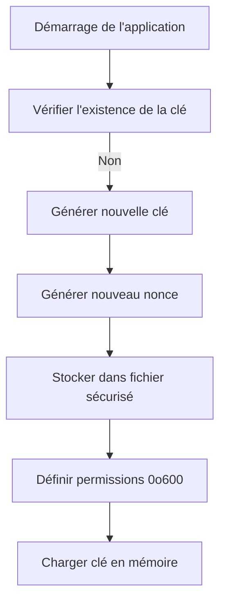
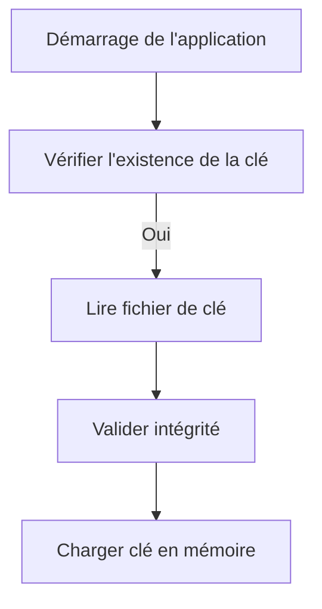
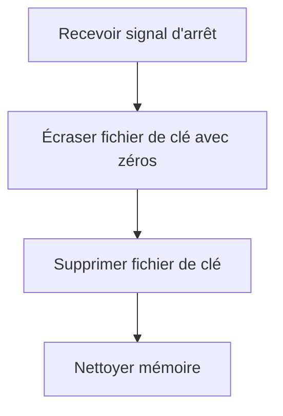

# Système de Stockage Sécurisé des Clés - Documentation

## Table des Matières

1. [Aperçu](#aperçu)
2. [Fonctionnalités de Sécurité](#fonctionnalités-de-sécurité)
3. [Implémentation](#implémentation)
4. [Cycle de Vie des Clés](#cycle-de-vie-des-clés)
5. [Utilisation](#utilisation)
6. [Sécurité Avancée](#sécurité-avancée)
7. [Dépannage](#dépannage)
8. [Bonnes Pratiques](#bonnes-pratiques)

## Aperçu

Le système de stockage sécurisé des clés est conçu pour gérer les clés cryptographiques utilisées par le système de logging sécurisé. Il fournit une solution robuste pour le stockage, la gestion et la protection des clés de chiffrement.

## Fonctionnalités de Sécurité

### 1. Stockage de Fichiers Sécurisé

- **Emplacement protégé** : Les clés sont stockées dans `~/.local/share/janus-monitor/security/logging_key.bin`
- **Permissions restrictives** : Le fichier est créé avec les permissions `0o600` (lecture/écriture par le propriétaire uniquement)
- **Répertoire dédié** : Les clés sont stockées dans un répertoire de sécurité dédié

### 2. Génération de Clés

- **Clés aléatoires** : Utilise `secretbox::gen_key()` pour générer des clés cryptographiquement sûres
- **Nonces uniques** : Génère des nonces uniques pour chaque session
- **Algorithme fort** : Utilise XSalsa20-Poly1305 pour le chiffrement

### 3. Gestion du Cycle de Vie

- **Initialisation** : Génère de nouvelles clés si elles n'existent pas
- **Chargement** : Charge les clés existantes depuis le stockage sécurisé
- **Nettoyage** : Efface de manière sécurisée les clés lors de l'arrêt

### 4. Protection contre les Accès Non Autorisés

- **Effacement sécurisé** : Écrasement des clés avec des zéros avant suppression
- **Gestion de la mémoire** : Nettoyage approprié des données sensibles
- **Isolation** : Les clés ne sont jamais exposées dans les logs ou les messages d'erreur

## Implémentation

### Structure du Module

```rust
pub struct SecureKeyStorage {
    key: secretbox::Key,
    nonce: secretbox::Nonce,
    key_file_path: PathBuf,
}
```

### Initialisation

Le système s'initialise automatiquement au premier appel à `get_secure_key_storage()` :

```rust
pub fn get_secure_key_storage() -> Result<&'static SecureKeyStorage, String> {
    SECURE_KEY_STORAGE.get_or_try_init(SecureKeyStorage::new)
}
```

### Stockage des Clés

Les clés sont stockées dans un fichier binaire avec la structure suivante :

```
[32 bytes: clé de chiffrement][24 bytes: nonce]
```

## Cycle de Vie des Clés

### 1. Première Exécution



### 2. Exécutions Ultérieures



### 3. Arrêt de l'Application



## Utilisation

### Initialisation

Dans votre code d'application principal (généralement `main.rs`) :

```rust
fn main() {
    // Initialiser le système de logging sécurisé
    if let Err(e) = secure_key_storage::init_secure_logging() {
        eprintln!("Failed to initialize secure logging: {}", e);
        // Gérer l'erreur de manière appropriée
    }
    
    // Le reste de votre code d'application
    // ...
    
    // À l'arrêt
    if let Err(e) = secure_key_storage::shutdown_secure_logging() {
        eprintln!("Failed to shutdown secure logging: {}", e);
    }
}
```

### Utilisation dans le Code

Le système de logging sécurisé utilise automatiquement le stockage sécurisé des clés :

```rust
// Cette fonction utilise le stockage sécurisé des clés en interne
fn log_address(tag: &str, address: &str) {
    if address.is_empty() {
        println!("[{}][EMPTY_ADDRESS]", tag);
        return;
    }
    
    // Only show first 6 and last 4 characters in clear
    let display_addr = if address.len() > 10 {
        format!("{}...{}", &address[..6], &address[address.len()-4..])
    } else {
        "[SHORT_ADDR]".to_string()
    };
    
    // Cette fonction utilise get_secure_key_storage() en interne
    secure_log(&format!("[{}] Address", tag), address)?;
    println!("[{}] Display address: {}", tag, display_addr);
}
```

## Sécurité Avancée

### 1. Rotation des Clés

Pour implémenter la rotation des clés :

```rust
pub fn rotate_key() -> Result<(), String> {
    let old_storage = get_secure_key_storage()?;
    
    // Générer de nouvelles clés
    let new_key = secretbox::gen_key();
    let new_nonce = secretbox::gen_nonce();
    
    // Sauvegarder les anciennes clés pour le rechiffrement
    let backup_path = old_storage.key_file_path.with_extension("bak");
    std::fs::copy(&old_storage.key_file_path, &backup_path)
        .map_err(|e| e.to_string())?;
    
    // Sauvegarder les nouvelles clés
    let mut file = OpenOptions::new()
        .write(true)
        .truncate(true)
        .mode(0o600)
        .open(&old_storage.key_file_path)
        .map_err(|e| e.to_string())?;
    
    file.write_all(new_key.as_ref())
        .map_err(|e| e.to_string())?;
    file.write_all(new_nonce.as_ref())
        .map_err(|e| e.to_string())?;
    
    // Mettre à jour le stockage global
    let new_storage = SecureKeyStorage {
        key: new_key,
        nonce: new_nonce,
        key_file_path: old_storage.key_file_path.clone(),
    };
    
    // Remplacer l'ancienne instance
    let _ = SECURE_KEY_STORAGE.set(new_storage);
    
    Ok(())
}
```

### 2. Chiffrement des Clés avec Mot de Passe

Pour ajouter une couche de sécurité supplémentaire :

```rust
use argon2::{self, Config};

pub fn create_password_protected_key(password: &str) -> Result<Vec<u8>, String> {
    // Dériver une clé à partir du mot de passe
    let salt = secretbox::gen_key(); // Utiliser une clé aléatoire comme sel
    let config = Config::default();
    
    let mut output_key_material = [0u8; 32]; // Pour une clé de 256 bits
    argon2::hash_password_into(
        password.as_bytes(),
        salt.as_ref(),
        &mut output_key_material,
        &config,
    ).map_err(|e| e.to_string())?;
    
    Ok(output_key_material.to_vec())
}
```

### 3. Stockage Matériel (HSM)

Pour les environnements haute sécurité, envisagez d'intégrer un module de sécurité matériel (HSM) :

```rust
// Exemple d'intégration avec PKCS#11
pub fn load_key_from_hsm() -> Result<secretbox::Key, String> {
    // Code pour charger la clé depuis un HSM
    // Cela nécessite une bibliothèque PKCS#11 comme openssl ou pkcs11-rs
    
    // Placeholder - implémentation réelle dépend du HSM spécifique
    Ok(secretbox::gen_key()) // Remplacer par le chargement réel depuis HSM
}
```

## Dépannage

### Problèmes Courants

#### 1. Échec de la Création du Répertoire

**Erreur** : `Failed to create security directory`

**Solution** :
- Vérifiez les permissions du répertoire `~/.local/share/janus-monitor`
- Assurez-vous que l'utilisateur a les droits d'écriture
- Vérifiez l'espace disque disponible

#### 2. Échec de la Lecture de la Clé

**Erreur** : `Failed to read key` ou `Failed to read nonce`

**Solution** :
- Vérifiez que le fichier de clé n'a pas été corrompu
- Supprimez le fichier et laissez l'application en générer un nouveau
- Vérifiez les permissions du fichier (`chmod 600 ~/.local/share/janus-monitor/security/logging_key.bin`)

#### 3. Échec de l'Écriture de la Clé

**Erreur** : `Failed to write key` ou `Failed to write nonce`

**Solution** :
- Vérifiez l'espace disque disponible
- Vérifiez les permissions du répertoire
- Assurez-vous que le système de fichiers n'est pas en lecture seule

### Journalisation des Erreurs

Les erreurs du système de stockage des clés sont journalisées avec des messages descriptifs. Pour activer une journalisation plus détaillée :

```rust
fn secure_log(message: &str, sensitive_data: &str) -> Result<(), String> {
    let key_storage = match get_secure_key_storage() {
        Ok(storage) => storage,
        Err(e) => {
            eprintln!("[SECURE_LOG_ERROR] Failed to get key storage: {}", e);
            return Err(format!("Key storage error: {}", e));
        }
    };
    
    let encrypted = secretbox::seal(
        sensitive_data.as_bytes(), 
        &key_storage.get_nonce(), 
        &key_storage.get_key()
    );
    let encrypted_hex = hex::encode(encrypted);
    
    println!("[SECURE_LOG] {} [ENCRYPTED: {}]", message, encrypted_hex);
    Ok(())
}
```

## Bonnes Pratiques

### 1. Gestion des Clés

- **Ne jamais stocker les clés en clair** dans le code ou les fichiers de configuration
- **Rotater les clés périodiquement** (par exemple, tous les 30 jours)
- **Sauvegarder les clés** dans un endroit sécurisé avant la rotation
- **Limiter l'accès** aux fichiers de clés aux utilisateurs et processus nécessaires uniquement

### 2. Déploiement

- **Permissions** : Assurez-vous que le répertoire de sécurité a les permissions `700`
- **Propriétaire** : Le répertoire doit être possédé par l'utilisateur qui exécute l'application
- **Séparation** : Dans les environnements multi-utilisateurs, chaque utilisateur doit avoir son propre jeu de clés

### 3. Sécurité du Système

- **Chiffrement du disque** : Utilisez le chiffrement complet du disque pour protéger les clés au repos
- **Mémoire sécurisée** : Utilisez `mlock` pour empêcher les clés d'être échangées sur le disque
- **Nettoyage de la mémoire** : Effacez explicitement les clés de la mémoire après utilisation

### 4. Surveillance

- **Surveiller les accès** aux fichiers de clés
- **Alerter sur les échecs** de chargement des clés
- **Journaliser les rotations** de clés pour l'audit
- **Vérifier l'intégrité** des clés périodiquement

## Exemple Complet

Voici un exemple complet d'intégration dans une application Tauri :

```rust
// Dans votre fichier main.rs ou lib.rs
mod secure_key_storage;

#[tauri::command]
async fn init_app() -> Result<(), String> {
    // Initialiser le système de logging sécurisé
    secure_key_storage::init_secure_logging()?;
    
    // Le reste de l'initialisation de l'application
    Ok(())
}

#[tauri::command]
async fn shutdown_app() -> Result<(), String> {
    // Nettoyer le système de logging sécurisé
    secure_key_storage::shutdown_secure_logging()?;
    
    Ok(())
}

fn main() {
    tauri::Builder::default()
        .invoke_handler(tauri::generate_handler![init_app, shutdown_app])
        .run(tauri::generate_context!())
        .expect("error while running tauri application");
}
```

## Conclusion

Le système de stockage sécurisé des clés fournit une solution robuste pour gérer les clés cryptographiques utilisées par le système de logging sécurisé. En suivant les bonnes pratiques et en implémentant les fonctionnalités de sécurité avancées, vous pouvez atteindre un haut niveau de protection pour les données sensibles tout en permettant un débogage efficace.

Pour des questions ou des améliorations, veuillez consulter le code source ou ouvrir une issue dans le système de suivi des problèmes.
